# High-Level Design (HLD): URL Shortener

This document outlines the high-level architecture for a scalable URL shortener service built on a microservices architecture. It defines the major components, their responsibilities, and the data flows for key operations.

---

## 1. System Architecture

The system is designed to separate high-traffic, read-heavy operations from standard, write-heavy API operations. This ensures that the core function of redirecting URLs remains fast and highly available, even under heavy load.

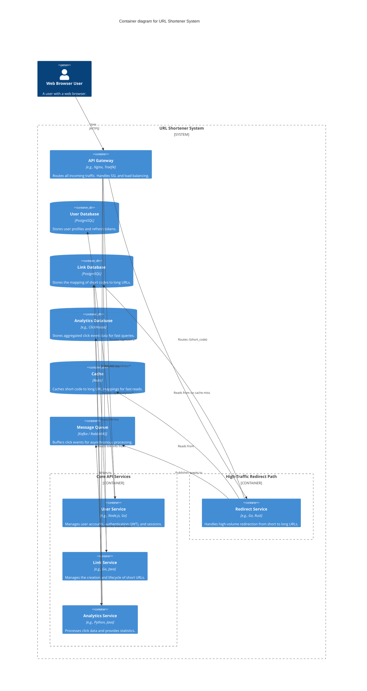
```mermaid
C4Container
    title Container diagram for URL Shortener System

    Person(client, "Web Browser User", "A user with a web browser.")

    System_Boundary(system, "URL Shortener System") {
        Container(gateway, "API Gateway", "e.g., Nginx, Traefik", "Routes all incoming traffic. Handles SSL and load balancing.")
        
        Container_Boundary(api_services, "Core API Services") {
            Container(user_service, "User Service", "e.g., Node.js, Go", "Manages user accounts, authentication (JWT), and sessions.")
            Container(link_service, "Link Service", "e.g., Go, Java", "Manages the creation and lifecycle of short URLs.")
            Container(analytics_service, "Analytics Service", "e.g., Python, Java", "Processes click data and provides statistics.")
        }
        
        Container_Boundary(redirect_path, "High-Traffic Redirect Path") {
            Container(redirect_service, "Redirect Service", "e.g., Go, Rust", "Handles high-volume redirection from short to long URLs.")
        }

        ContainerDb(user_db, "User Database", "PostgreSQL", "Stores user profiles and refresh tokens.")
        ContainerDb(link_db, "Link Database", "PostgreSQL", "Stores the mapping of short codes to long URLs.")
        ContainerDb(analytics_db, "Analytics Database", "e.g., ClickHouse", "Stores aggregated click event data for fast queries.")
        ContainerDb(cache, "Cache", "Redis", "Caches short code to long URL mappings for fast reads.")
        Container(queue, "Message Queue", "Kafka / RabbitMQ", "Buffers click events for asynchronous processing.")
    }

    Rel(client, gateway, "Uses", "HTTPS")

    Rel(gateway, user_service, "Routes /api/users/*")
    Rel(gateway, link_service, "Routes /api/links/*")
    Rel(gateway, analytics_service, "Routes /api/analytics/*")
    Rel(gateway, redirect_service, "Routes /{short_code}")

    Rel(user_service, user_db, "Reads/Writes")
    Rel(link_service, link_db, "Reads/Writes")
    
    Rel(redirect_service, cache, "Reads from")
    Rel(redirect_service, link_db, "Reads from on cache miss")
    Rel(redirect_service, queue, "Publishes events to")

    Rel(analytics_service, queue, "Consumes events from")
    Rel(analytics_service, analytics_db, "Writes to")
    Rel(analytics_service, link_db, "Reads link info from")
```

### Component Responsibilities

*   **API Gateway / Load Balancer**: The single entry point for all client requests. It routes traffic to the appropriate backend service based on the request path. It is also responsible for concerns like SSL termination and rate limiting.

*   **User Service**: Handles all user-related concerns: registration, login, profile management, and authentication (issuing JWTs). It owns the `users` and `refresh_tokens` databases.

*   **Link Service**: Manages the lifecycle of shortened URLs for authenticated users. This includes creating, updating, deleting, and listing links. It owns the `urls` database.

*   **Redirect Service**: Its sole responsibility is to perform the redirection from a `short_code` to a `long_url`. It is heavily optimized for reads and designed for high availability and low latency. It does not have its own database but reads from the Link DB and a cache.

*   **Analytics Service**: Processes click events asynchronously. It consumes events from the message queue and aggregates them into a database for analysis. It provides endpoints for users to view statistics for their links.

*   **Cache (Redis)**: A fast, in-memory key-value store used by the `Redirect Service` to cache `short_code` to `long_url` mappings. This serves the vast majority of redirect requests without hitting a database.

*   **Message Queue (Kafka)**: A durable message broker that decouples the `Redirect Service` from the `Analytics Service`. It buffers click events, allowing the system to absorb huge traffic spikes without losing data or slowing down the redirect process.

---

## 2. Data Flow

The following diagrams illustrate the sequence of events for the primary use cases.

### Data Flow: URL Shortening (Authenticated User)

This flow describes creating a new short link, with logic for handling both custom and auto-generated short codes.

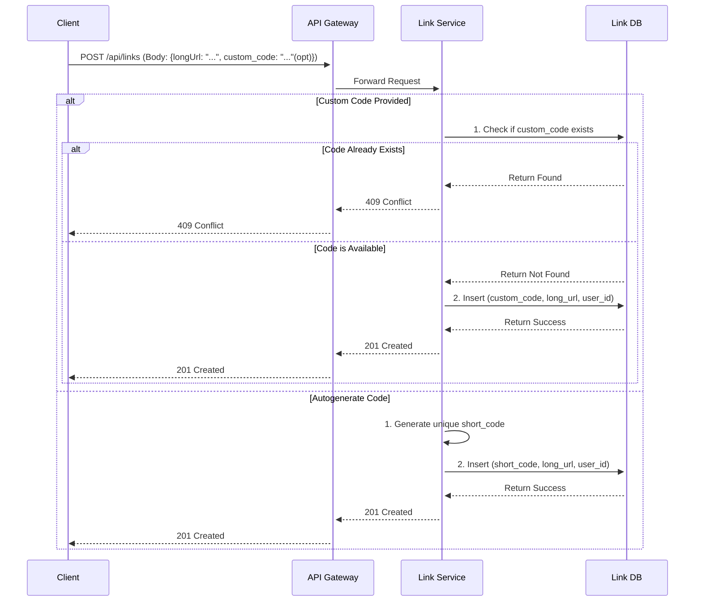
```mermaid
sequenceDiagram
    participant C as Client
    participant GW as API Gateway
    participant LS as Link Service
    participant LDB as Link DB

    C->>+GW: POST /api/links (Body: {longUrl: "...", custom_code: "..."(opt)})
    GW->>+LS: Forward Request
    
    alt Custom Code Provided
        LS->>+LDB: 1. Check if custom_code exists
        alt Code Already Exists
            LDB-->>LS: Return Found
            LS-->>GW: 409 Conflict
            GW-->>C: 409 Conflict
        else Code is Available
            LDB-->>LS: Return Not Found
            LS->>+LDB: 2. Insert (custom_code, long_url, user_id)
            LDB-->>LS: Return Success
            LS-->>GW: 201 Created
            GW-->>C: 201 Created
        end
    else Autogenerate Code
        LS->>LS: 1. Generate unique short_code
        LS->>+LDB: 2. Insert (short_code, long_url, user_id)
        LDB-->>LS: Return Success
        LS-->>GW: 201 Created
        GW-->>C: 201 Created
    end
```

### Data Flow: URL Redirection and Click Tracking

This is the most critical and highest-volume flow. It shows the "cache-aside" pattern, asynchronous event publishing, and handling for non-existent links.

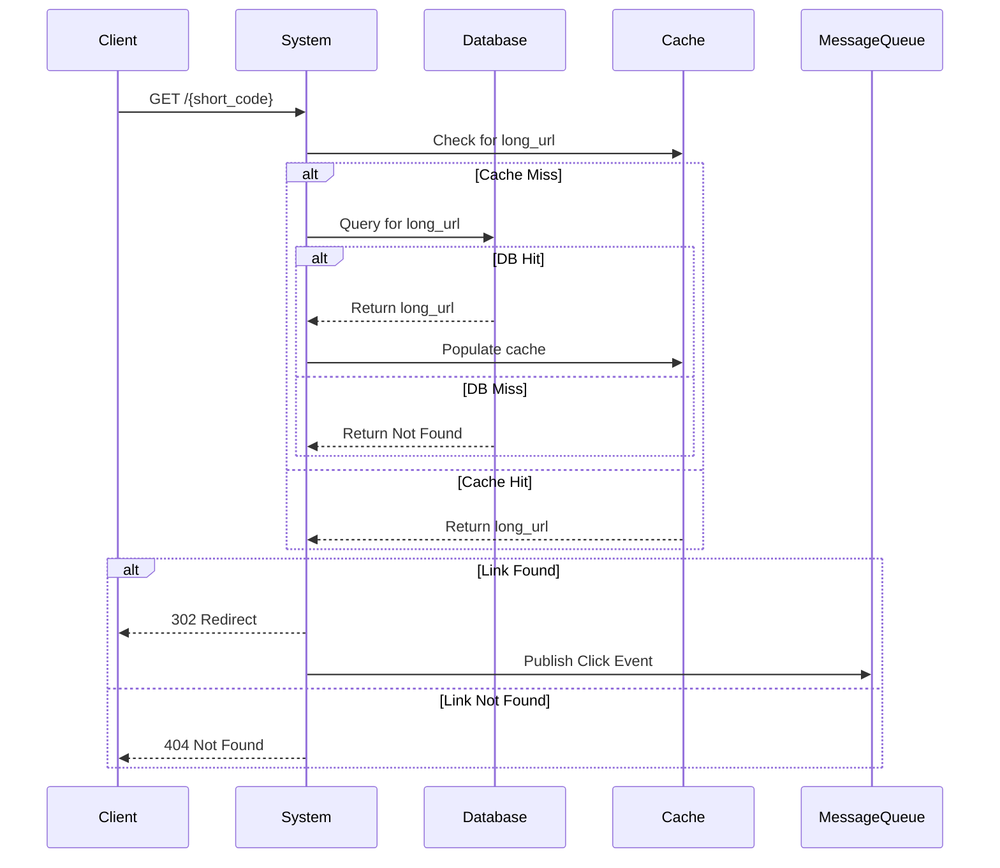
```mermaid
sequenceDiagram
    participant Client
    participant System
    participant Database
    participant Cache
    participant MessageQueue

    Client->>System: GET /{short_code}
    System->>Cache: Check for long_url
    
    alt Cache Miss
      System->>Database: Query for long_url
      alt DB Hit
        Database-->>System: Return long_url
        System->>Cache: Populate cache
      else DB Miss
        Database-->>System: Return Not Found
      end
    else Cache Hit
      Cache-->>System: Return long_url
    end
    
    alt Link Found
      System-->>Client: 302 Redirect
      System->>MessageQueue: Publish Click Event
    else Link Not Found
      System-->>Client: 404 Not Found
    end
```

### Data Flow: User Authentication

The following diagrams illustrate the key authentication and user management flows.

### Data Flow: User Registration

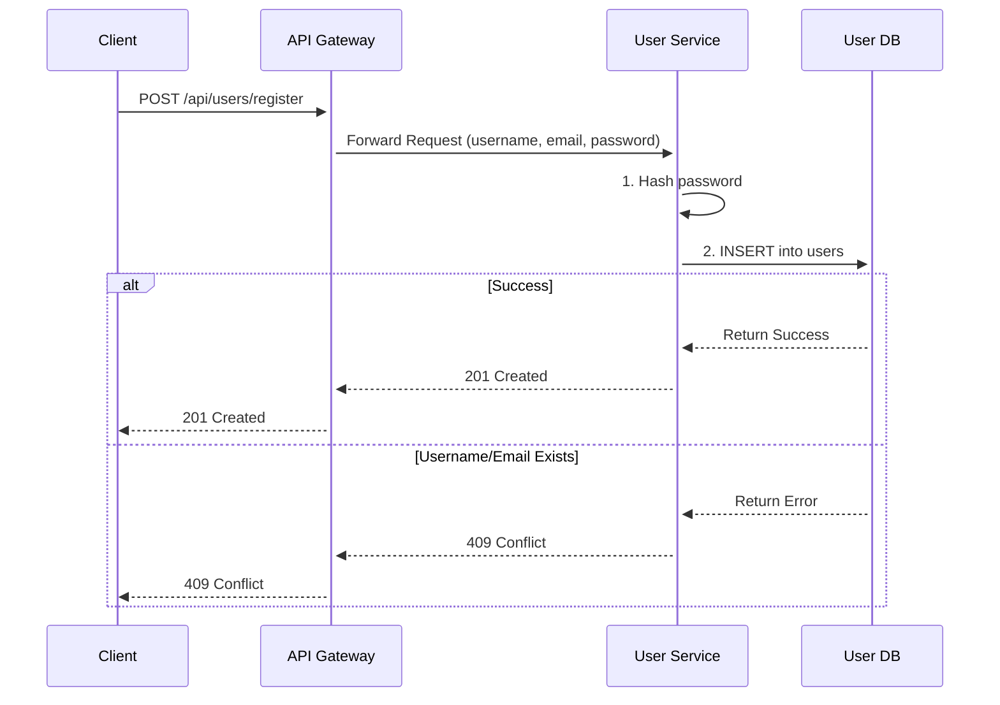
```mermaid
sequenceDiagram
    participant C as Client
    participant GW as API Gateway
    participant US as User Service
    participant UDB as User DB

    C->>+GW: POST /api/users/register
    GW->>+US: Forward Request (username, email, password)
    
    US->>US: 1. Hash password
    US->>+UDB: 2. INSERT into users
    
    alt Success
        UDB-->>US: Return Success
        US-->>GW: 201 Created
        GW-->>C: 201 Created
    else Username/Email Exists
        UDB-->>US: Return Error
        US-->>GW: 409 Conflict
        GW-->>C: 409 Conflict
    end
```

### Data Flow: User Login

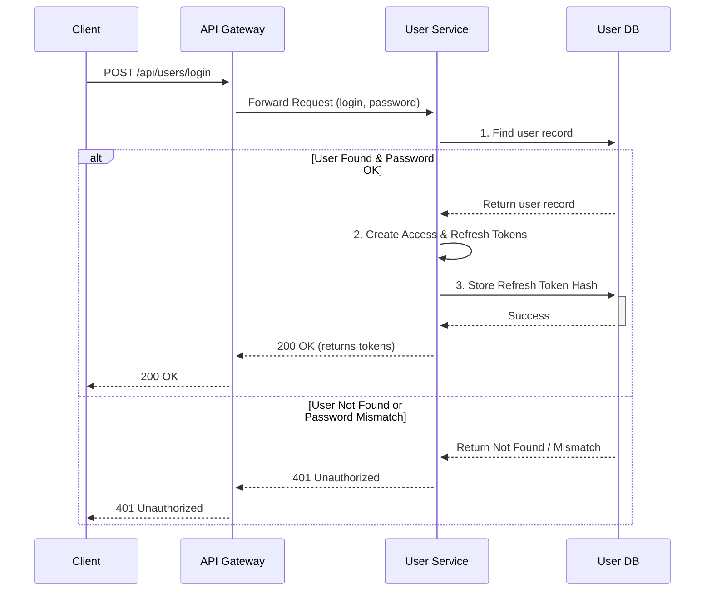
```mermaid
sequenceDiagram
    participant C as Client
    participant GW as API Gateway
    participant US as User Service
    participant UDB as User DB

    C->>+GW: POST /api/users/login
    GW->>+US: Forward Request (login, password)
    
    US->>+UDB: 1. Find user record
    
    alt User Found & Password OK
        UDB-->>US: Return user record
        US->>US: 2. Create Access & Refresh Tokens
        US->>+UDB: 3. Store Refresh Token Hash
        UDB-->>-US: Success
        US-->>GW: 200 OK (returns tokens)
        GW-->>C: 200 OK
    else User Not Found or Password Mismatch
        UDB-->>US: Return Not Found / Mismatch
        US-->>GW: 401 Unauthorized
        GW-->>C: 401 Unauthorized
    end
```

### Data Flow: User Logout

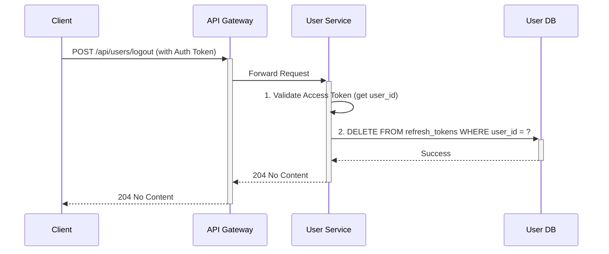
```mermaid
sequenceDiagram
    participant C as Client
    participant GW as API Gateway
    participant US as User Service
    participant UDB as User DB

    C->>+GW: POST /api/users/logout (with Auth Token)
    GW->>+US: Forward Request
    US->>US: 1. Validate Access Token (get user_id)
    US->>+UDB: 2. DELETE FROM refresh_tokens WHERE user_id = ?
    UDB-->>-US: Success
    US-->>-GW: 204 No Content
    GW-->>-C: 204 No Content
```

### Data Flow: Check if Short Code Exists
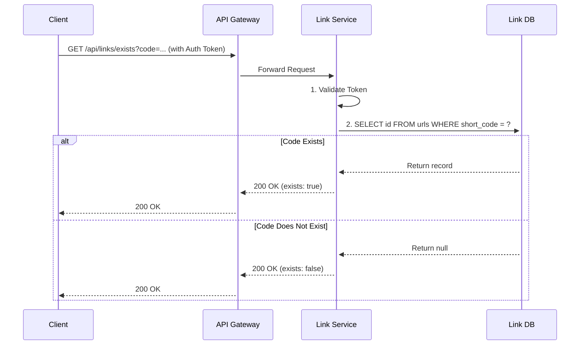
```mermaid
sequenceDiagram
    participant C as Client
    participant GW as API Gateway
    participant LS as Link Service
    participant LDB as Link DB

    C->>+GW: GET /api/links/exists?code=... (with Auth Token)
    GW->>+LS: Forward Request
    
    LS->>LS: 1. Validate Token
    LS->>+LDB: 2. SELECT id FROM urls WHERE short_code = ?
    
    alt Code Exists
        LDB-->>LS: Return record
        LS-->>GW: 200 OK (exists: true)
        GW-->>C: 200 OK
    else Code Does Not Exist
        LDB-->>LS: Return null
        LS-->>GW: 200 OK (exists: false)
        GW-->>C: 200 OK
    end
```

### Data Flow: Update User Profile
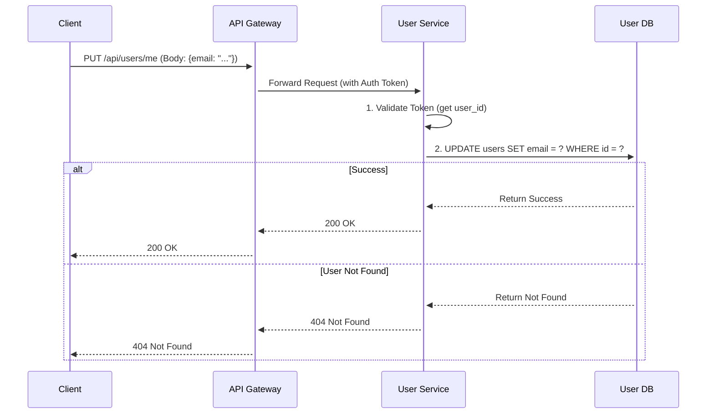
```mermaid
sequenceDiagram
    participant C as Client
    participant GW as API Gateway
    participant US as User Service
    participant UDB as User DB

    C->>+GW: PUT /api/users/me (Body: {email: "..."})
    GW->>+US: Forward Request (with Auth Token)
    
    US->>US: 1. Validate Token (get user_id)
    US->>+UDB: 2. UPDATE users SET email = ? WHERE id = ?
    
    alt Success
        UDB-->>US: Return Success
        US-->>GW: 200 OK
        GW-->>C: 200 OK
    else User Not Found
        UDB-->>US: Return Not Found
        US-->>GW: 404 Not Found
        GW-->>C: 404 Not Found
    end
```

### Data Flow: Create Anonymous Link
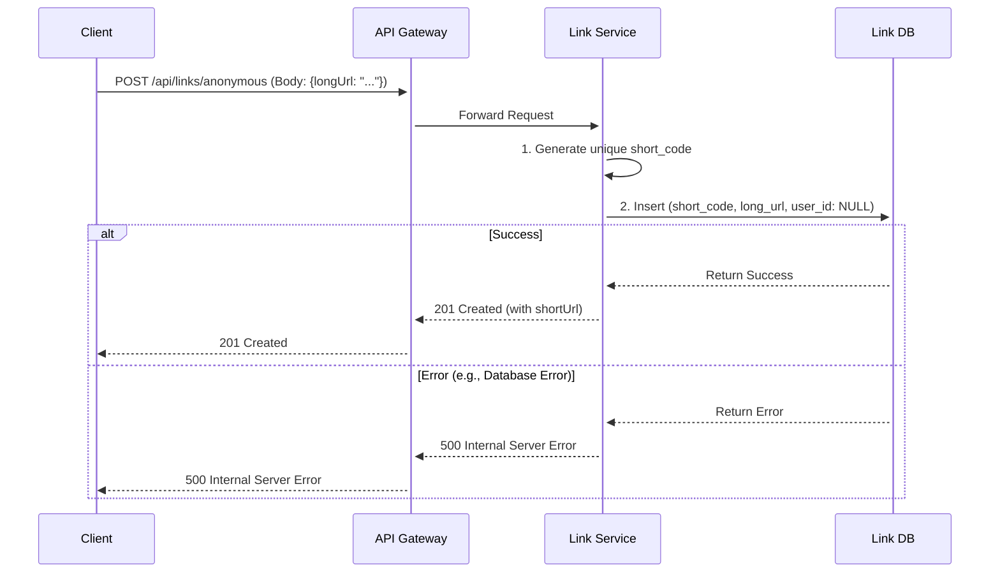
```mermaid
sequenceDiagram
    participant C as Client
    participant GW as API Gateway
    participant LS as Link Service
    participant LDB as Link DB

    C->>+GW: POST /api/links/anonymous (Body: {longUrl: "..."})
    GW->>+LS: Forward Request
    
    LS->>LS: 1. Generate unique short_code
    LS->>+LDB: 2. Insert (short_code, long_url, user_id: NULL)
    
    alt Success
        LDB-->>LS: Return Success
        LS-->>GW: 201 Created (with shortUrl)
        GW-->>C: 201 Created
    else Error (e.g., Database Error)
        LDB-->>LS: Return Error
        LS-->>GW: 500 Internal Server Error
        GW-->>C: 500 Internal Server Error
    end
```

### Data Flow: Get All Links for a User
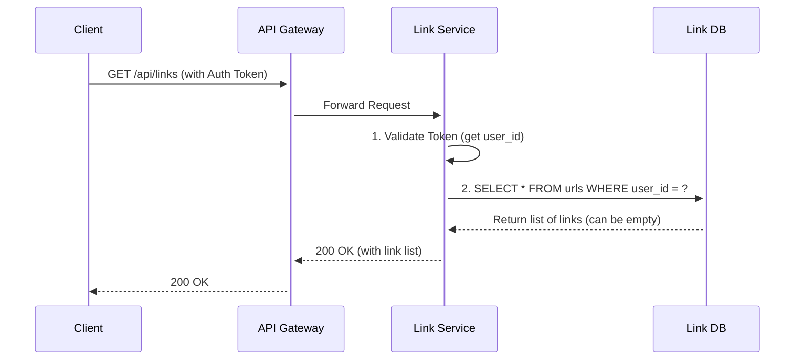
```mermaid
sequenceDiagram
    participant C as Client
    participant GW as API Gateway
    participant LS as Link Service
    participant LDB as Link DB

    C->>+GW: GET /api/links (with Auth Token)
    GW->>+LS: Forward Request
    
    LS->>LS: 1. Validate Token (get user_id)
    LS->>+LDB: 2. SELECT * FROM urls WHERE user_id = ?
    
    LDB-->>LS: Return list of links (can be empty)
    LS-->>GW: 200 OK (with link list)
    GW-->>C: 200 OK
```

### Data Flow: Get Single Link Details
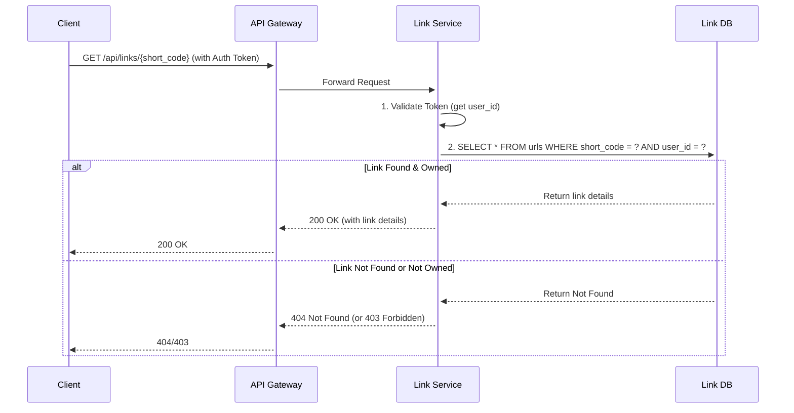
```mermaid
sequenceDiagram
    participant C as Client
    participant GW as API Gateway
    participant LS as Link Service
    participant LDB as Link DB

    C->>+GW: GET /api/links/{short_code} (with Auth Token)
    GW->>+LS: Forward Request
    
    LS->>LS: 1. Validate Token (get user_id)
    LS->>+LDB: 2. SELECT * FROM urls WHERE short_code = ? AND user_id = ?
    
    alt Link Found & Owned
        LDB-->>LS: Return link details
        LS-->>GW: 200 OK (with link details)
        GW-->>C: 200 OK
    else Link Not Found or Not Owned
        LDB-->>LS: Return Not Found
        LS-->>GW: 404 Not Found (or 403 Forbidden)
        GW-->>C: 404/403
    end
```

### Data Flow: Get Analytics Overview
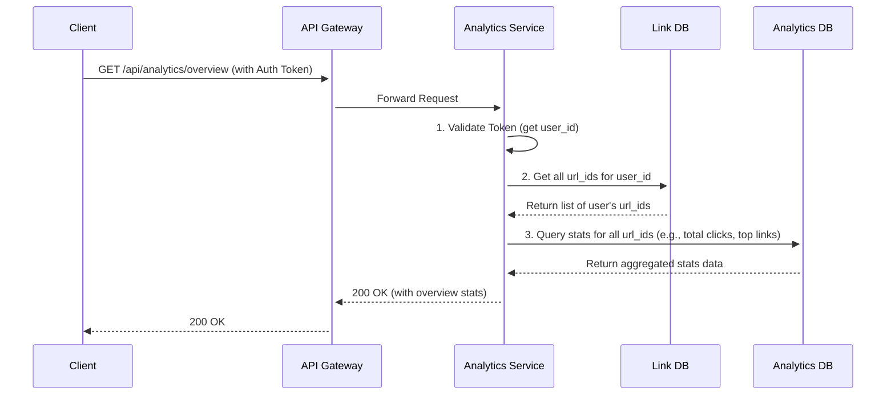
```mermaid
sequenceDiagram
    participant C as Client
    participant GW as API Gateway
    participant AS as Analytics Service
    participant LDB as Link DB
    participant ADB as Analytics DB

    C->>+GW: GET /api/analytics/overview (with Auth Token)
    GW->>+AS: Forward Request
    
    AS->>AS: 1. Validate Token (get user_id)
    AS->>+LDB: 2. Get all url_ids for user_id
    LDB-->>AS: Return list of user's url_ids
    
    AS->>+ADB: 3. Query stats for all url_ids (e.g., total clicks, top links)
    ADB-->>AS: Return aggregated stats data
    
    AS-->>GW: 200 OK (with overview stats)
    GW-->>C: 200 OK
```

---

## 4. Data Flow: Link Management & Analytics

The following diagrams illustrate the flows for managing links and retrieving their usage statistics.

### Data Flow: Check if Short Code Exists

```mermaid
sequenceDiagram
    participant C as Client
    participant GW as API Gateway
    participant LS as Link Service
    participant LDB as Link DB

    C->>+GW: GET /api/links/exists?code=... (with Auth Token)
    GW->>+LS: Forward Request
    
    LS->>LS: 1. Validate Token
    LS->>+LDB: 2. SELECT id FROM urls WHERE short_code = ?
    
    alt Code Exists
        LDB-->>LS: Return record
        LS-->>GW: 200 OK (exists: true)
        GW-->>C: 200 OK
    else Code Does Not Exist
        LDB-->>LS: Return null
        LS-->>GW: 200 OK (exists: false)
        GW-->>C: 200 OK
    end
```

### Data Flow: Update Link

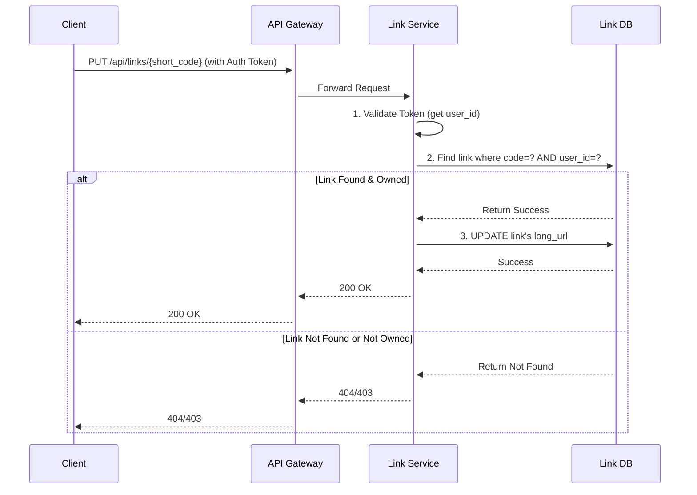
```mermaid
sequenceDiagram
    participant C as Client
    participant GW as API Gateway
    participant LS as Link Service
    participant LDB as Link DB

    C->>+GW: PUT /api/links/{short_code} (with Auth Token)
    GW->>+LS: Forward Request
    
    LS->>LS: 1. Validate Token (get user_id)
    LS->>+LDB: 2. Find link where code=? AND user_id=?
    
    alt Link Found & Owned
        LDB-->>LS: Return Success
        LS->>+LDB: 3. UPDATE link's long_url
        LDB-->>LS: Success
        LS-->>GW: 200 OK
        GW-->>C: 200 OK
    else Link Not Found or Not Owned
        LDB-->>LS: Return Not Found
        LS-->>GW: 404/403
        GW-->>C: 404/403
    end
```

### Data Flow: Delete Link

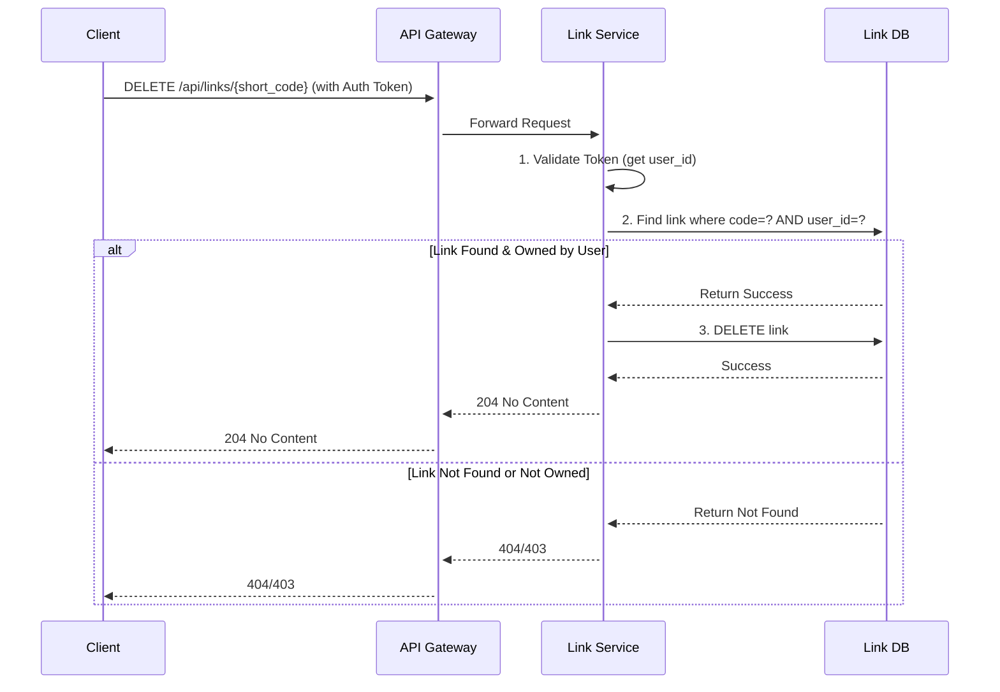
```mermaid
sequenceDiagram
    participant C as Client
    participant GW as API Gateway
    participant LS as Link Service
    participant LDB as Link DB

    C->>+GW: DELETE /api/links/{short_code} (with Auth Token)
    GW->>+LS: Forward Request
    
    LS->>LS: 1. Validate Token (get user_id)
    LS->>+LDB: 2. Find link where code=? AND user_id=?
    
    alt Link Found & Owned by User
        LDB-->>LS: Return Success
        LS->>+LDB: 3. DELETE link
        LDB-->>LS: Success
        LS-->>GW: 204 No Content
        GW-->>C: 204 No Content
    else Link Not Found or Not Owned
        LDB-->>LS: Return Not Found
        LS-->>GW: 404/403
        GW-->>C: 404/403
    end
```

### Data Flow: Get Link Analytics

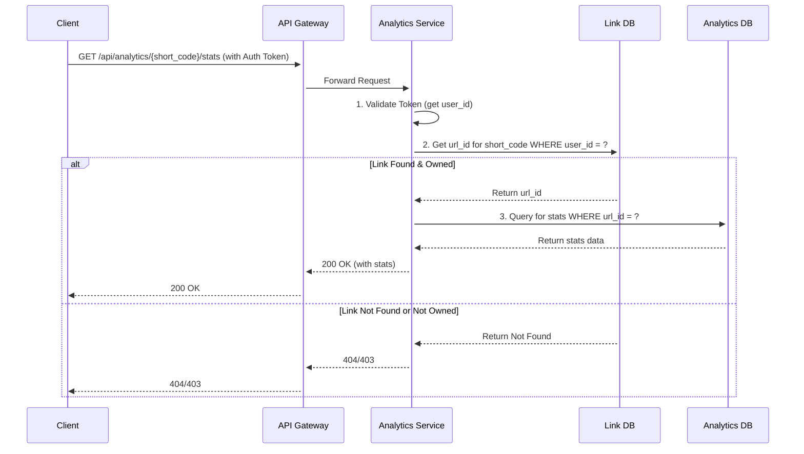
```mermaid
sequenceDiagram
    participant C as Client
    participant GW as API Gateway
    participant AS as Analytics Service
    participant LDB as Link DB
    participant ADB as Analytics DB

    C->>+GW: GET /api/analytics/{short_code}/stats (with Auth Token)
    GW->>+AS: Forward Request
    
    AS->>AS: 1. Validate Token (get user_id)
    AS->>+LDB: 2. Get url_id for short_code WHERE user_id = ?
    
    alt Link Found & Owned
        LDB-->>AS: Return url_id
        AS->>+ADB: 3. Query for stats WHERE url_id = ?
        ADB-->>AS: Return stats data
        AS-->>GW: 200 OK (with stats)
        GW-->>C: 200 OK
    else Link Not Found or Not Owned
        LDB-->>AS: Return Not Found
        AS-->>GW: 404/403
        GW-->>C: 404/403
    end
```

---

## 5. Data Flow: Additional User & Link Flows

The following diagrams illustrate remaining key flows for user management and link retrieval.

### Data Flow: Token Refresh

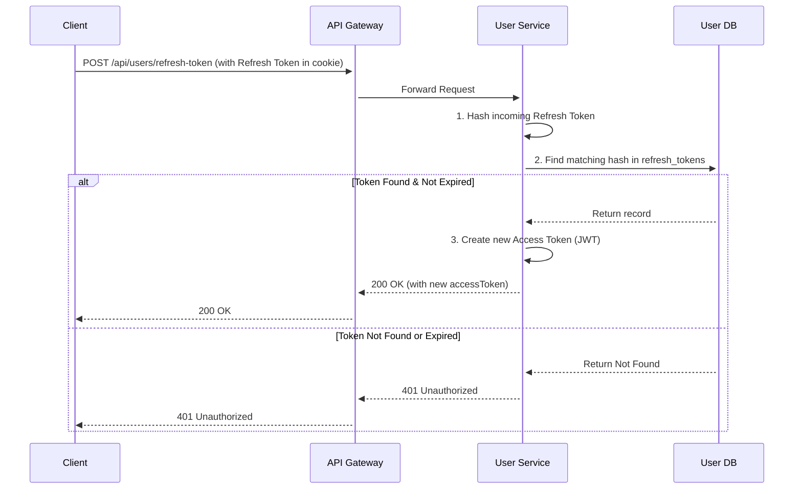
```mermaid
sequenceDiagram
    participant C as Client
    participant GW as API Gateway
    participant US as User Service
    participant UDB as User DB

    C->>+GW: POST /api/users/refresh-token (with Refresh Token in cookie)
    GW->>+US: Forward Request
    
    US->>US: 1. Hash incoming Refresh Token
    US->>+UDB: 2. Find matching hash in refresh_tokens
    
    alt Token Found & Not Expired
        UDB-->>US: Return record
        US->>US: 3. Create new Access Token (JWT)
        US-->>GW: 200 OK (with new accessToken)
        GW-->>C: 200 OK
    else Token Not Found or Expired
        UDB-->>US: Return Not Found
        US-->>GW: 401 Unauthorized
        GW-->>C: 401 Unauthorized
    end
```

### Data Flow: Check if Username Exists

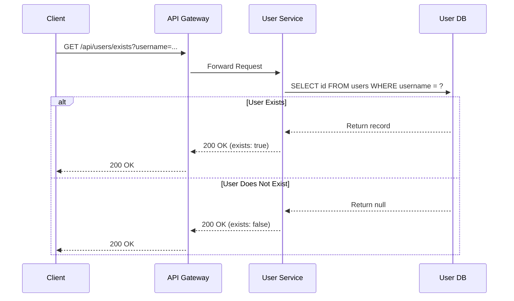
```mermaid
sequenceDiagram
    participant C as Client
    participant GW as API Gateway
    participant US as User Service
    participant UDB as User DB

    C->>+GW: GET /api/users/exists?username=...
    GW->>+US: Forward Request
    
    US->>+UDB: SELECT id FROM users WHERE username = ?
    
    alt User Exists
        UDB-->>US: Return record
        US-->>GW: 200 OK (exists: true)
        GW-->>C: 200 OK
    else User Does Not Exist
        UDB-->>US: Return null
        US-->>GW: 200 OK (exists: false)
        GW-->>C: 200 OK
    end
```

### Data Flow: Get User Profile

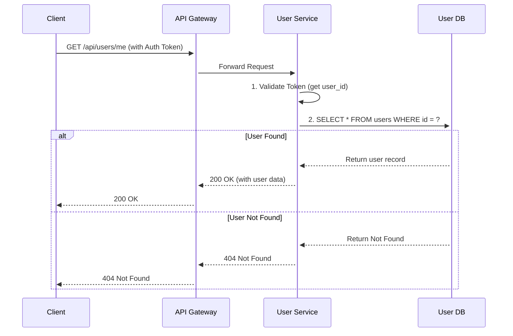
```mermaid
sequenceDiagram
    participant C as Client
    participant GW as API Gateway
    participant US as User Service
    participant UDB as User DB

    C->>+GW: GET /api/users/me (with Auth Token)
    GW->>+US: Forward Request
    
    US->>US: 1. Validate Token (get user_id)
    US->>+UDB: 2. SELECT * FROM users WHERE id = ?
    
    alt User Found
        UDB-->>US: Return user record
        US-->>GW: 200 OK (with user data)
        GW-->>C: 200 OK
    else User Not Found
        UDB-->>US: Return Not Found
        US-->>GW: 404 Not Found
        GW-->>C: 404 Not Found
    end
```

### Data Flow: Create Anonymous Link

```mermaid
sequenceDiagram
    participant C as Client
    participant GW as API Gateway
    participant LS as Link Service
    participant LDB as Link DB

    C->>+GW: POST /api/links/anonymous (Body: {longUrl: "..."})
    GW->>+LS: Forward Request
    
    LS->>LS: 1. Generate unique short_code
    LS->>+LDB: 2. Insert (short_code, long_url, user_id: NULL)
    
    alt Success
        LDB-->>LS: Return Success
        LS-->>GW: 201 Created (with shortUrl)
        GW-->>C: 201 Created
    else Error (e.g., Database Error)
        LDB-->>LS: Return Error
        LS-->>GW: 500 Internal Server Error
        GW-->>C: 500 Internal Server Error
    end
```

### Data Flow: Update User Profile
```mermaid
sequenceDiagram
    participant C as Client
    participant GW as API Gateway
    participant US as User Service
    participant UDB as User DB

    C->>+GW: PUT /api/users/me (Body: {email: "..."})
    GW->>+US: Forward Request (with Auth Token)
    
    US->>US: 1. Validate Token (get user_id)
    US->>+UDB: 2. UPDATE users SET email = ? WHERE id = ?
    
    alt Success
        UDB-->>US: Return Success
        US-->>GW: 200 OK
        GW-->>C: 200 OK
    else User Not Found
        UDB-->>US: Return Not Found
        US-->>GW: 404 Not Found
        GW-->>C: 404 Not Found
    end
```

### Data Flow: Get All Links for a User
```mermaid
sequenceDiagram
    participant C as Client
    participant GW as API Gateway
    participant LS as Link Service
    participant LDB as Link DB

    C->>+GW: GET /api/links (with Auth Token)
    GW->>+LS: Forward Request
    
    LS->>LS: 1. Validate Token (get user_id)
    LS->>+LDB: 2. SELECT * FROM urls WHERE user_id = ?
    
    LDB-->>LS: Return list of links (can be empty)
    LS-->>GW: 200 OK (with link list)
    GW-->>C: 200 OK
```

### Data Flow: Get Single Link Details
```mermaid
sequenceDiagram
    participant C as Client
    participant GW as API Gateway
    participant LS as Link Service
    participant LDB as Link DB

    C->>+GW: GET /api/links/{short_code} (with Auth Token)
    GW->>+LS: Forward Request
    
    LS->>LS: 1. Validate Token (get user_id)
    LS->>+LDB: 2. SELECT * FROM urls WHERE short_code = ? AND user_id = ?
    
    alt Link Found & Owned
        LDB-->>LS: Return link details
        LS-->>GW: 200 OK (with link details)
        GW-->>C: 200 OK
    else Link Not Found or Not Owned
        LDB-->>LS: Return Not Found
        LS-->>GW: 404 Not Found (or 403 Forbidden)
        GW-->>C: 404/403
    end
```

### Data Flow: Get Analytics Overview
```mermaid
sequenceDiagram
    participant C as Client
    participant GW as API Gateway
    participant AS as Analytics Service
    participant LDB as Link DB
    participant ADB as Analytics DB

    C->>+GW: GET /api/analytics/overview (with Auth Token)
    GW->>+AS: Forward Request
    
    AS->>AS: 1. Validate Token (get user_id)
    AS->>+LDB: 2. Get all url_ids for user_id
    LDB-->>AS: Return list of user's url_ids
    
    AS->>+ADB: 3. Query stats for all url_ids (e.g., total clicks, top links)
    ADB-->>AS: Return aggregated stats data
    
    AS-->>GW: 200 OK (with overview stats)
    GW-->>C: 200 OK
```
