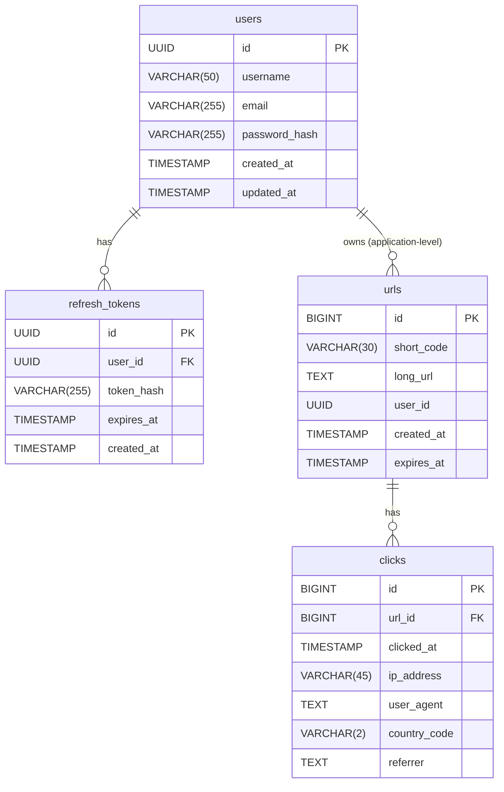

# Low-Level Design (LLD): URL Shortener

This document outlines the database schema for a URL shortener service built on a microservices architecture.

## Core Microservices

The system is divided into several key services, each with its own responsibilities and data ownership. All services use a shared Amazon RDS PostgreSQL instance, with each service having its own logical database or schema for strong logical isolation.

1.  **User Service**: Manages user accounts and authentication.
2.  **Link Service**: Handles the creation and management of short URLs.
3.  **Redirect Service**: Manages the redirection from short to long URLs. It requires fast, read-only access to link data.
4.  **Analytics Service**: Tracks click data and provides usage statistics.

---

## Database Schema

Each service manages its own data. The following schemas represent the core tables required for the system to function.

### 1. User Service

This service owns the `users` and `refresh_tokens` tables.

#### `users` table
Stores information about registered users.

| Column Name     | Data Type                  | Constraints & Notes                               |
|-----------------|----------------------------|---------------------------------------------------|
| `id`            | `UUID`                     | Primary Key. UUID is preferred in distributed systems. |
| `username`      | `VARCHAR(50)`              | Unique, Indexed. For user login.                  |
| `email`         | `VARCHAR(255)`             | Unique, Indexed. For communication.               |
| `password_hash` | `VARCHAR(255)`             | Stores the hashed password.                       |
| `created_at`    | `TIMESTAMP WITH TIME ZONE` | Auto-generated on record creation.                |
| `updated_at`    | `TIMESTAMP WITH TIME ZONE` | Auto-updated on record modification.              |

#### `refresh_tokens` table
Stores a reference to the long-lived refresh tokens to allow for immediate session invalidation upon logout.

| Column Name  | Data Type                  | Constraints & Notes                                           |
|--------------|----------------------------|---------------------------------------------------------------|
| `id`         | `UUID`                     | Primary Key.                                                  |
| `user_id`    | `UUID`                     | Foreign Key -> `users.id`. Indexed for quick lookups.         |
| `token_hash` | `VARCHAR(255)`             | A hash of the refresh token. Indexed for fast lookups. |
| `expires_at` | `TIMESTAMP WITH TIME ZONE` | Must match the expiration of the actual token.                |
| `created_at` | `TIMESTAMP WITH TIME ZONE` | Auto-generated on record creation.                            |

---

### 2. Link Service

This service owns the `urls` table, which is the central table for the entire application.

#### `urls` table
Stores the mapping between the original long URL and the generated short code.

| Column Name  | Data Type                  | Constraints & Notes                               |
|--------------|----------------------------|---------------------------------------------------|
| `id`         | `BIGINT`                   | Primary Key, Auto-incrementing.                   |
| `short_code` | `VARCHAR(30)`              | **Unique, Indexed**. The unique identifier in the short URL. |
| `long_url`   | `TEXT`                     | Not Null. The original URL to redirect to.        |
| `user_id`    | `UUID`                     | Nullable for anonymous users. Application-level integrity: not a DB foreign key; validated by Link Service via User Service API. |
| `created_at` | `TIMESTAMP WITH TIME ZONE` | Auto-generated on record creation.                |
| `expires_at` | `TIMESTAMP WITH TIME ZONE` | Nullable. For links with an expiration date.      |

**Note on `short_code`:** This column must have a unique index to ensure fast lookups for the Redirect Service and to prevent collisions.

**Note on `user_id`:** In a microservices architecture, `user_id` is not a database-level foreign key. The Link Service verifies user existence via the User Service at the application level.

---

### 3. Analytics Service

This service owns the `clicks` table. To handle high write loads, click events should ideally be sent to a message queue (e.g., Kafka) and then batch-processed into this table.

#### `clicks` table
Stores a record for each time a shortened link is accessed.

| Column Name    | Data Type                  | Constraints & Notes                               |
|----------------|----------------------------|---------------------------------------------------|
| `id`           | `BIGINT`                   | Primary Key, Auto-incrementing.                   |
| `url_id`       | `BIGINT`                   | Foreign Key -> `urls.id`. Indexed for fast lookups. |
| `clicked_at`   | `TIMESTAMP WITH TIME ZONE` | The timestamp of the click event. Indexed.        |
| `ip_address`   | `VARCHAR(45)`              | IP address of the client (supports IPv4 & IPv6).  |
| `user_agent`   | `TEXT`                     | User-Agent string from the client's browser.      |
| `country_code` | `VARCHAR(2)`               | ISO 3166-1 alpha-2 country code (e.g., 'US').     |
| `referrer`     | `TEXT`                     | The referring URL, if available.                  |

---

## Table Relationships

A simple ERD-style representation of the relationships:

> Note: Each service's tables reside in its own logical database or schema within a shared Amazon RDS PostgreSQL instance. The relationship between users and urls is enforced at the application level, not via a database foreign key.

---

## Authentication Strategy

The system uses a **JSON Web Token (JWT)**-based strategy with a two-token model for optimal security and user experience: **Access Tokens** and **Refresh Tokens**.

1.  **Login**:
    *   Upon successful login (`POST /api/users/login`), the `User Service` generates two tokens:
        *   **Access Token**: A short-lived JWT (e.g., 15-60 minutes) containing user details (`user_id`). This is sent with every authenticated API request.
        *   **Refresh Token**: A long-lived, opaque token (e.g., 7-30 days). A hash of this token is stored in the `refresh_tokens` database table. It is used exclusively to get a new Access Token.
    *   The Refresh Token should be stored in a secure `HttpOnly` cookie on the client-side to prevent XSS attacks.

2.  **Authenticated Requests**:
    *   The client sends the Access Token in the `Authorization: Bearer <token>` header.
    *   Microservices can independently verify the token's signature and expiration without needing to contact the User Service, preserving the stateless benefit of JWTs for most operations.

3.  **Token Refresh**:
    *   When an Access Token expires, the client sends the Refresh Token to a dedicated endpoint (`POST /api/users/refresh-token`).
    *   The `User Service` verifies the Refresh Token by looking up its hash in the `refresh_tokens` table. If valid, it issues a new Access Token.

4.  **Logout**:
    *   The client calls the `POST /api/users/logout` endpoint.
    *   The `User Service` deletes the corresponding record from the `refresh_tokens` table, invalidating the session immediately.
    *   The client then discards its locally stored tokens.

This hybrid approach ensures that most API calls are fast and stateless, while still providing a secure, stateful mechanism for revoking user sessions.

---

## API Endpoints

This section defines the API routes for each service, divided into endpoints that require authentication and those that do not.

### Un-authenticated API Routes

These endpoints are publicly accessible and do not require a user to be logged in.

#### Redirect Service
*   `GET /{short_code}`
    *   **Description**: The primary endpoint of the entire application. It redirects the user to the `long_url` associated with the `short_code`. This must be fast, public, and highly available.
    *   **Response**: `302 Found` or `301 Moved Permanently` redirect to the `long_url`.

#### User Service
*   `POST /api/users/register`
    *   **Description**: Allows a new user to create an account.
    *   **Request Body**: `{ "username": "...", "email": "...", "password": "..." }`
    *   **Response**: `201 Created` with user information (excluding password).

*   `GET /api/users/exists`
    *   **Description**: Checks if a given username is already registered. This endpoint must be strictly rate-limited at the API Gateway to prevent username enumeration abuse.
    *   **Query Parameters**: `?username=someuser`
    *   **Response**: `200 OK` with a JSON body: `{ "exists": true }` or `{ "exists": false }`.

*   `POST /api/users/login`
    *   **Description**: Authenticates a user using their email or username and returns an access token and a refresh token.
    *   **Request Body**: `{ "login": "...", "password": "..." }` (The `login` field can be either the user's email or username).
    *   **Response**: `200 OK` with an `accessToken` and a `refreshToken` (sent via HttpOnly cookie).

*   `POST /api/users/refresh-token`
    *   **Description**: Obtains a new access token using a valid refresh token.
    *   **Request Body**: Expects the refresh token to be sent in an `HttpOnly` cookie.
    *   **Response**: `200 OK` with a new `accessToken`.

#### Link Service
*   `POST /api/links/anonymous`
    *   **Description**: Creates a short URL for an anonymous user. The `user_id` in the `urls` table would be `NULL`.
    *   **Request Body**: `{ "long_url": "...", "expires_at": "..." (optional) }`
    *   **Response**: `201 Created` with the `short_code` and the full short URL.

---

### Authenticated API Routes

These endpoints require a valid authentication token in the request header (e.g., `Authorization: Bearer <token>`).

#### User Service
*   `GET /api/users/me`
    *   **Description**: Retrieves the profile information for the currently logged-in user.
    *   **Response**: `200 OK` with user details.

*   `PUT /api/users/me`
    *   **Description**: Updates the profile information for the currently logged-in user (e.g., change email, password).
    *   **Request Body**: `{ "email": "...", "password": "..." (optional) }`
    *   **Response**: `200 OK` with the updated user details.

*   `POST /api/users/logout`
    *   **Description**: Logs the user out by invalidating their refresh token.
    *   **Response**: `204 No Content`.

#### Link Service
*   `POST /api/links`
    *   **Description**: Creates a new short URL associated with the authenticated user. If a `custom_code` is provided, it's used after checking for uniqueness. Otherwise, a random code is generated.
    *   **Request Body**: `{ "long_url": "...", "expires_at": "..." (optional), "custom_code": "..." (optional) }`
    *   **Response**: `201 Created` with the link details. `409 Conflict` if the `custom_code` already exists.

*   `GET /api/links`
    *   **Description**: Retrieves a list of all short URLs created by the authenticated user.
    *   **Response**: `200 OK` with a list of link objects.

*   `GET /api/links/exists`
    *   **Description**: Checks if a given custom `short_code` is already in use. This endpoint must be rate-limited.
    *   **Query Parameters**: `?code=my-custom-link`
    *   **Response**: `200 OK` with a JSON body: `{ "exists": true }` or `{ "exists": false }`.

*   `GET /api/links/{short_code}`
    *   **Description**: Retrieves the details for a specific short URL owned by the user.
    *   **Response**: `200 OK` with link details. `404 Not Found` if the link doesn't exist or `403 Forbidden` if the user doesn't own it.

*   `PUT /api/links/{short_code}`
    *   **Description**: Updates a user's existing short URL (e.g., change the target `long_url` or expiration).
    *   **Request Body**: `{ "long_url": "...", "expires_at": "..." }`
    *   **Response**: `200 OK` with the updated link details.

*   `DELETE /api/links/{short_code}`
    *   **Description**: Deletes a short URL owned by the user.
    *   **Response**: `204 No Content`.

#### Analytics Service
*   `GET /api/analytics/{short_code}/stats`
    *   **Description**: Retrieves detailed analytics for a specific short URL owned by the user.
    *   **Response**: `200 OK` with a JSON object containing statistics (e.g., total clicks, clicks over time, referrers, geographic data). `403 Forbidden` if the user doesn't own the link.

*   `GET /api/analytics/overview`
    *   **Description**: Retrieves an overview of statistics for all links owned by the user (e.g., total clicks across all links, most popular links).
    *   **Response**: `200 OK` with a summary of user-wide analytics.
